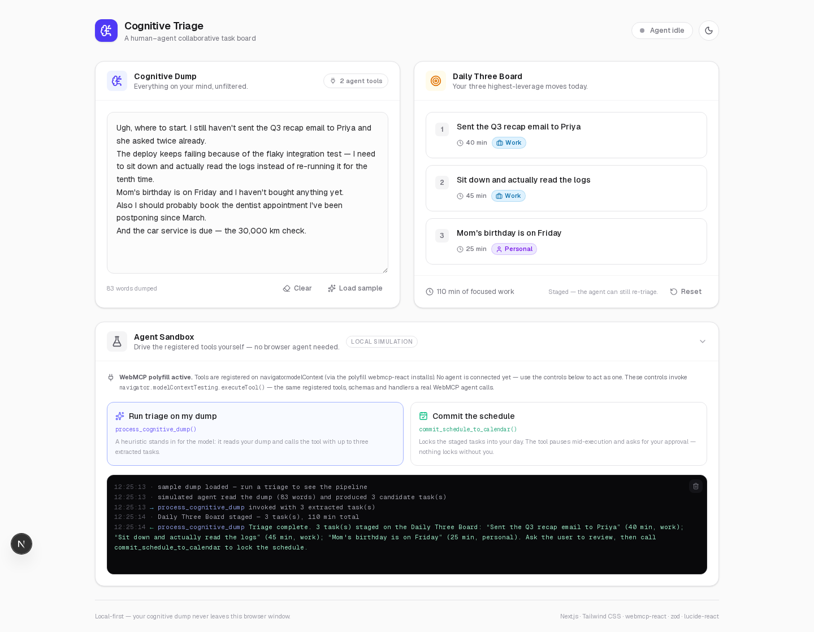
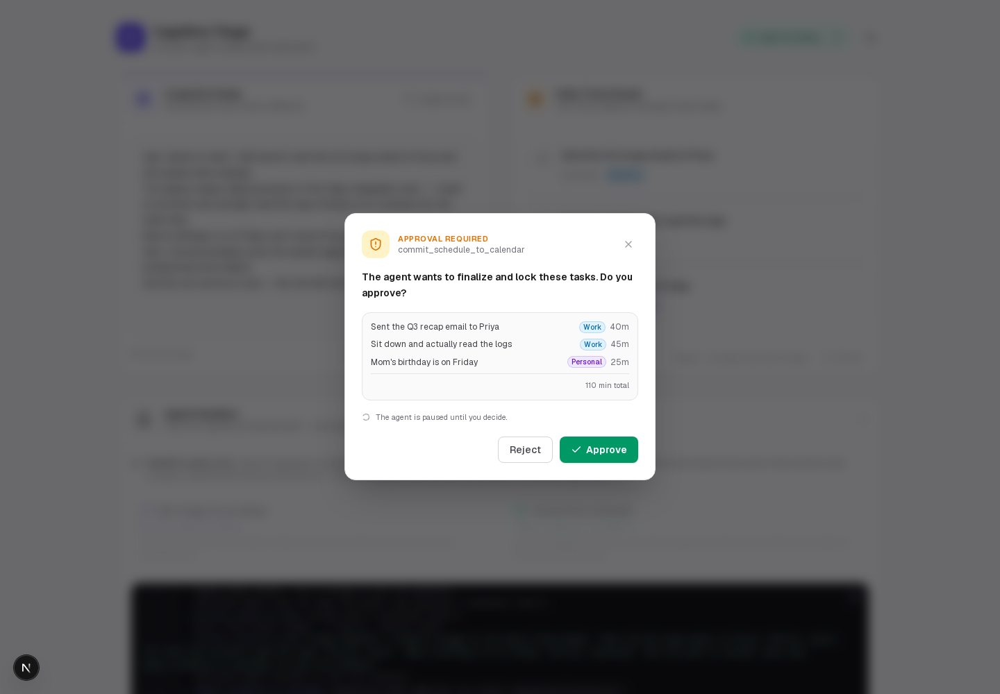

# Cognitive Triage

A **human–agent collaborative task board** built with Next.js, Tailwind CSS, and
[WebMCP](https://github.com/webmcp) — the page itself acts as an MCP server,
exposing tools that browser-based AI agents can discover and execute.

Dump everything on your mind into the **Cognitive Dump** (left). An agent calls
`process_cognitive_dump` to triage the mess into at most three prioritized
tasks on the **Daily Three Board** (right). When the agent wants to finalize
the day, it calls `commit_schedule_to_calendar` — and execution **pauses**
until you click *Approve* or *Reject* in a confirmation modal. Nothing locks
without you.



## Stack

- **Next.js 16** (App Router, TypeScript) + **Tailwind CSS v4** (class-based
  dark mode, no flash on load)
- **webmcp-react@0.1.0** — `useMcpTool` hook + `WebMCPProvider`
- **zod** — tool input schemas (compiled to JSON Schema for the registry,
  enforced again at execution time)
- **lucide-react** — icons

> **Why `webmcp-react@0.1.0`?** This is the version whose `useMcpTool` API
> matches this app's requirements: handlers receive a `ModelContextClient`
> instance and can call `client.requestUserInteraction()` to pause for human
> approval. `webmcp-react@0.2.0` removed `ModelContextClient` /
> `requestUserInteraction` from the hook entirely, so 0.1.x is pinned.
>
> **Why `zod@3`?** `webmcp-react` converts Zod schemas to JSON Schema via
> `zod-to-json-schema`, which does not yet understand Zod 4 objects (it emits
> an empty schema). Zod 3.25.x produces the full JSON Schema — enums, `maxItems`,
> required fields — so agents see the real contract.

## Getting started

```bash
npm install
npm run dev        # http://localhost:3000
```

Production build:

```bash
npm run build && npm start
```

## The two WebMCP tools

Both are registered with `useMcpTool` inside `<WebMCPProvider>` and land on
`navigator.modelContext` for any WebMCP-capable browser agent to call.

### 1. `process_cognitive_dump`

> Extract a prioritized list of up to three actionable tasks from the user's unstructured input.

Zod input schema:

```ts
z.object({
  extractedTasks: z
    .array(
      z.object({
        title: z.string(),
        effortEstimate: z.number(),           // minutes
        category: z.enum(["work", "personal", "urgent"]),
      }),
    )
    .max(3),
});
```

The execution handler stages the extracted tasks on the Daily Three Board
(title, effort in minutes, category badge per card). While the handler runs,
its hook's `state.isExecuting` drives the pulsing **Agent Status** indicator in
the header.

### 2. `commit_schedule_to_calendar`

> Finalize and lock the tasks staged on the Daily Three Board into the user's calendar for the day.

Takes no arguments. The handler receives the `ModelContextClient` instance and
gates on the human before completing:

```ts
handler: async (_input, client) => {
  // …
  const approved = await client.requestUserInteraction(
    () =>
      new Promise<boolean>((resolve) => {
        approvalResolveRef.current = resolve; // modal buttons resolve this
        setApprovalOpen(true);
      }),
  );
  // Execution stays parked on the await above until the user clicks
  // Approve / Reject; only then does control flow back to the agent.
};
```



The modal asks verbatim: *"The agent wants to finalize and lock these tasks. Do
you approve?"* — Approve locks the board (emerald state, locks on each card);
Reject leaves the tasks staged but unlocked and returns an `isError` result to
the agent. Because the tool is mid-execution the whole time, the Agent Status
indicator keeps pulsing while the agent waits on you.

## Trying it without a browser agent

Native WebMCP is still experimental (Chrome ships it behind an Early Preview
flag). Until an agent is connected, the **Agent Sandbox** at the bottom of the
page lets you drive the exact same pipeline yourself:

- **Run triage on my dump** — a local heuristic stands in for the agent's
  model: it reads your dump and calls `process_cognitive_dump` with up to
  three extracted tasks.
- **Commit the schedule** — calls `commit_schedule_to_calendar`, which pops
  the approval gate and parks until you decide.

Both buttons invoke the tools through
`navigator.modelContextTesting.executeTool()` — the same registry, JSON-Schema
validation, Zod enforcement, handlers, and execution-state tracking a real
browser agent uses. The attached console logs every call, result, and
human decision.

## Project structure

```
app/
  layout.tsx            # fonts, metadata, pre-paint dark-mode script
  page.tsx              # renders the client app
  globals.css           # Tailwind v4 + dark variant + animations
components/
  cognitive-triage-app.tsx  # WebMCPProvider + state + both useMcpTool hooks
  cognitive-dump.tsx        # left panel — the unstructured inlet
  daily-three-board.tsx     # right panel — task cards, slots, lock state
  agent-status.tsx          # pulsing dot + spinner, driven by isExecuting
  approval-modal.tsx        # human-in-the-loop gate
  agent-sandbox.tsx         # local agent simulation + tool-call console
  theme-toggle.tsx          # class-based dark mode toggle
lib/
  schemas.ts            # zod schemas for both tools
  types.ts              # Task/category metadata, sample dump
  agent-sim.ts          # testing bridge + heuristic triage stand-in
scripts/
  e2e.mjs               # Playwright checks for the whole pipeline
```

## Testing

```bash
npx playwright install chromium        # once
npm run dev &                          # server on :3000
node scripts/e2e.mjs
```

The E2E script verifies tool registration and schemas (including the
`maxItems: 3` and category enum), the triage → board flow, the Agent Status
pulse during execution, both approval-gate outcomes, schema rejection of a
4-task payload, the human reset, and dark-mode persistence.

## Notes on WebMCP runtimes

- If the browser provides native `navigator.modelContext`, the app uses it and
  the sandbox reports “Native WebMCP detected”.
- Otherwise `webmcp-react` installs a lightweight polyfill; tools register the
  same way, and `navigator.modelContextTesting` (installed alongside) is what
  the sandbox uses to invoke them.
- Registration settles one tick after hydration (the provider flips its
  context once the runtime is ready), so tools may take a moment to appear on
  first load in dev.
